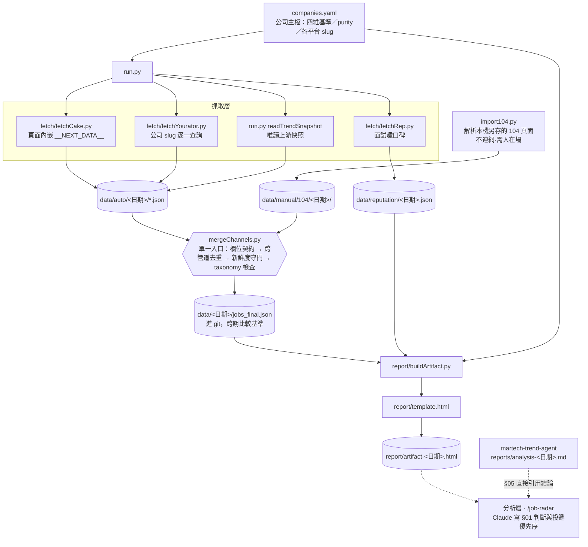

# 架構

四個來源匯進**一個守門入口**，再由一支資料驅動的產生器輸出報告：
**抓取 → 整併（單一入口）→ 報告 →（分析層）**。

與姊妹專案 `martech-trend-agent` 的單向管線不同，本專案的形狀是**漏斗**：
多來源、單一整併點。所有欄位契約、去重與新鮮度檢查都只在 `mergeChannels.py` 發生，
繞過它就沒有守門——這是本專案唯一的架構硬規則。

## 系統架構圖

## 模組職責

| 模組 | 職責 | 不負責 |
|------|------|--------|
| `companies.yaml` | **唯一需手動維護的檔**：公司名、`category`／`purity`、`hot`／`growth` 基準、各平台 slug、面試趣 code | 任何抓取邏輯 |
| `run.py` | 依旗標呼叫各 fetcher、寫 `data/auto/`，最後以 subprocess 呼叫 `mergeChannels.py` | 去重與守門 |
| `run.py::readTrendSnapshot` | 讀上游最新 `jobs.json` 並轉成本專案欄位；找不到就降級不硬相依 | 上游的正確性——但會對「快照比執行日舊」出聲 |
| `fetch/fetchCake.py` | Cake 職缺，三來源中唯一給結構化薪資與確切更新日 | — |
| `fetch/fetchYourator.py` | 補上游沒追蹤的公司（如 SHOPLINE），逐家 slug 查詢 | 產業關鍵詞掃描（那是上游做的） |
| `fetch/fetchRep.py` | 面試趣公司評價、心得數、年薪中位；心得數不足者不給分 | 職缺 |
| `import104.py` | 解析**使用者自己瀏覽器另存**的本機 104 頁面，三段回退（schema.org → `__NUXT__` → DOM） | 連網。**永遠不得排程**（← D-018） |
| `mergeChannels.py` | 欄位契約、跨管道去重、新鮮度守門、`category`／`purity` taxonomy 檢查 | 排序與判斷 |
| `report/buildArtifact.py` | 把 `jobs_final.json`＋口碑＋主檔組成 HTML，**沒有任何手抄數字** | 版面（在 `template.html`）、判斷（在分析層） |
| `report/template.html` | 版面與正文；§01／§04～§06 的敘事由分析層每期改寫 | 資料 |

## 資料流的三個要點

1. **去重鍵是平台職缺編號，不是「公司＋職稱」**。
   SHOPLINE 有兩個分屬不同團隊、職稱一模一樣的 `Data Analyst`，
   用職稱當鍵會少算一個——資料職本來就少，少算一個影響很大。
2. **口碑不進整併流**。它不是職缺，存在 `data/reputation/<日期>.json`；
   放進 `data/auto/` 會被 `mergeChannels.py` 當職缺檔掃到並抱怨頂層不是陣列。
3. **只有 `data/<日期>/jobs_final.json` 進 git**，它是「哪些缺消失了」的比較基準。
   `data/auto/` 是中間產物。

## 跨期比較的前提

差集以 `url` 為鍵。有兩個會製造假訊號的來源，判讀前必須先扣掉：

- **非追蹤公司**：上游的 Yourator 產業關鍵詞掃描每期回傳的公司會輪替。
  2026-08-10 那期「消失 16 筆」裡有 10 筆是仁寶電腦一家，不是有人關掉編制。
  → 看新增／消失前先濾掉 `companies.yaml` 以外的公司。
- **名單本身變動**：主檔 2026-08-06 從 20 家擴到 35 家，
  下一期的總數會跳一大截而市場沒變。
  → 名單有異動的那一期，只在「上期就已在名單裡的公司」這個子集內比較。

## 與 martech-trend-agent 的邊界

**唯讀消費者，介面是檔案不是程式。** 只讀它產出的 `data/raw/<日期>/jobs.json`
（六欄契約），不 import 它的模組、不改它的 `config.yaml`。
產業趨勢結論也不自己算——報告 §05 直接引用它當期的 `reports/analysis-<日期>.md`，
所以兩份報告不會互相打架（← D-018）。

⚠️ 跨 repo 讀檔讀到的是對方的**工作區**，不是對方的 main。
對方有未合併的 PR 時會拿到舊資料且沒有錯誤訊息，因此加了新鮮度守門。

## 技術棧

- Python 3.12、venv（`.venv/`，不進 git）
- 相依只有兩個：`requests`、`pyyaml`
- 無資料庫：狀態就是 `data/` 底下的 JSON 快照
- **禁止任何繞過 bot 防護的依賴**（cloudscraper、curl_impersonate、undetected-chromedriver 等）；
  來源加防護就放棄該來源，104 因此只走人工匯入
